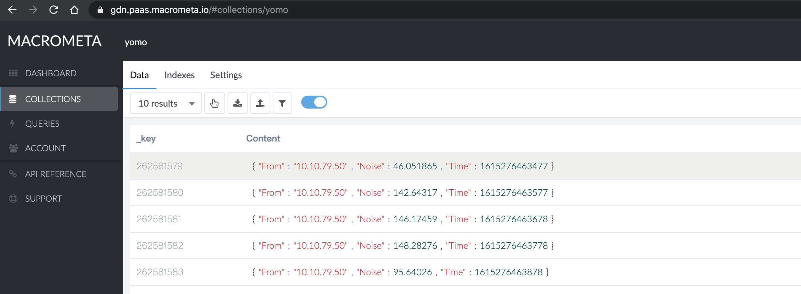

# YoMo-Sink-Macrometa-example

Macrometa 🙌 YoMo. This example demonstrates how to integrate Macrometa to YoMo and bulk insert data into Macrometa cloud after pre-processing on the edge.

## About Macrometa

Macrometa provides a noSQL database, Pub/Sub, Event Processing, and computing platform for building geo-distributed applications. Developers use Macrometa to build highly performant stateful apps and APIs

For more information, please visit [Macrometa homepage](https://www.macrometa.com/).

## About YoMo

[YoMo](https://github.com/yomorun/yomo) is an open-source Streaming Serverless Framework for building Low-latency Edge Computing applications. Built atop QUIC Transport Protocol and Functional Reactive Programming interface. makes real-time data processing reliable, secure, and easy.

## Quick Start

### Install YoMo cli and create a serverless edge applicatioons

please visit [YoMo homepage](https://github.com/yomorun/yomo#1-install-cli).

### Copy `app.go` to your serverless app

```go
package main

import (
	"bytes"
	"context"
	"encoding/json"
	"errors"
	"fmt"
	"net/http"
	"os"
	"strings"
	"time"

	"github.com/reactivex/rxgo/v2"
	y3 "github.com/yomorun/y3-codec-golang"
	"github.com/yomorun/yomo/pkg/rx"
)

// NoiseDataKey represents the Tag of a Y3 encoded data packet
const NoiseDataKey = 0x10

var (
	MacrometaUrl    = ""
	Macrometaapikey = ""
)

func init() {
	MacrometaUrl = os.Getenv("macrometaUrl")
	if MacrometaUrl != "" {
		MacrometaUrl = fmt.Sprintf("https://api-%s/_fabric/_system/_api/document/yomo", strings.Split(MacrometaUrl, "https://")[1])
	}
	Macrometaapikey = fmt.Sprintf("apikey %s", os.Getenv("macrometaapikey"))
}

// demonstrates a noise sensor 
type NoiseData struct {
	Noise float32 `y3:"0x11"`
	Time  int64   `y3:"0x12"`
	From  string  `y3:"0x13"`
}

// save data to macrometa
var saveDocs = func(_ context.Context, i interface{}) (interface{}, error) {
	buf, err := json.Marshal(i)
	if err != nil {
		return nil, err
	}
	req, err := http.NewRequest("POST", MacrometaUrl, bytes.NewBuffer(buf))
	req.Header.Set("authorization", Macrometaapikey)
	req.Header.Set("Content-Type", "application/json")
	if err != nil {
		return nil, err

	}
	client := &http.Client{}
	resp, err := client.Do(req)
	if err != nil {
		return nil, err

	}
	if !(resp.StatusCode == 201 || resp.StatusCode == 202) {
		return nil, errors.New("request fail")
	}

	defer resp.Body.Close()

	return fmt.Sprintf("⚡️ %d successfully stored in the macrometa", len(i.([]interface{}))), nil
}

// y3 callback
var callback = func(v []byte) (interface{}, error) {
	var mold NoiseData
	err := y3.ToObject(v, &mold)

	if err != nil {
		return nil, err
	}
	return mold, nil
}

// Handler will handle data in Rx way
func Handler(rxstream rx.RxStream) rx.RxStream {
	if MacrometaUrl == "" || Macrometaapikey == "" {
		panic("not found macrometaUrl or macrometaapikey.")
	}

	stream := rxstream.
		Subscribe(NoiseDataKey).
		OnObserve(callback).
		BufferWithTimeOrCount(rxgo.WithDuration(5*time.Second), 30).
		Map(saveDocs).
		StdOut().
		Encode(NoiseDataKey)
		
	return stream
}

```

### Run your serverless app in development

```bash
=> macrometaUrl=https://gdn.paas.macrometa.io macrometaapikey=xxxxx yomo dev
2021/03/09 16:16:58 Building the Serverless Function File...
2021/03/09 16:16:59 ✅ Listening on 0.0.0.0:4242
[StdOut]:  ⚡️ 30 successfully stored in the macrometa
[StdOut]:  ⚡️ 30 successfully stored in the macrometa
[StdOut]:  ⚡️ 30 successfully stored in the macrometa
[StdOut]:  ⚡️ 30 successfully stored in the macrometa
[StdOut]:  ⚡️ 30 successfully stored in the macrometa
[StdOut]:  ⚡️ 30 successfully stored in the macrometa
[StdOut]:  ⚡️ 30 successfully stored in the macrometa
```
### Verify data in Macrometa
 

